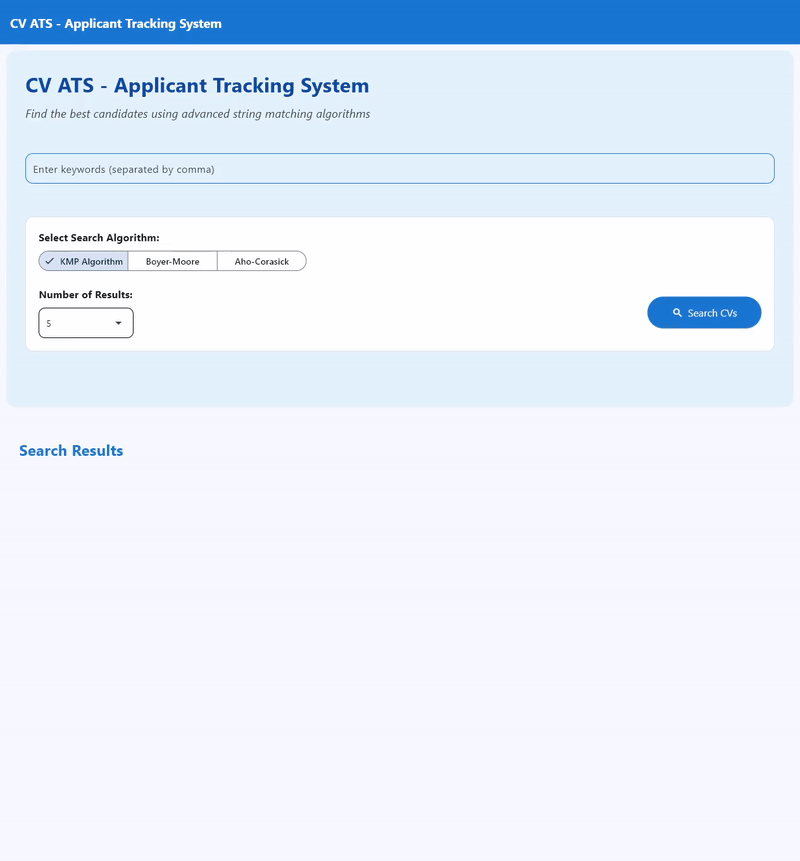

<div align="center"> 
  <h1> ATS Friendly CV Scanner </h1>
  <h3> Tugas Besar 3 IF2211 Strategi Algoritma </h3>




</div>

## Table of Contents

- [Program Description](#program-description)
  - [Fitur Utama](#fitur-utama)
  - [Implementasi Algoritma](#implementasi-algoritma)
  - [Input](#input)
  - [Output](#output)
  - [Struktur Folder](#struktur-folder)
- [Getting Started: Requirement dan Instalasi](#getting-started-requirement-dan-instalasi)
  - [1. Wajib Menggunakan Python 3.10+ dan MariaDB](#1-wajib-menggunakan-python-310-dan-mariadb)
  - [2. Instalasi Dependency](#2-instalasi-dependency)
  - [3. Menjalankan Program](#3-menjalankan-program)
- [Authors](#authors)

---

## Program Description

Program ini adalah **Aplikasi ATS (Applicant Tracking System) Friendly CV Scanner** yang dapat melakukan pencarian dan pemeringkatan CV pelamar kerja berdasarkan kecocokan kata kunci menggunakan berbagai algoritma string matching.  
Aplikasi ini juga mengimplementasikan **enkripsi RSA** pada data profil pelamar untuk menjaga keamanan data pribadi.

### Fitur Utama

- **Pencarian CV berbasis keyword** dengan algoritma:
  - **KMP (Knuth-Morris-Pratt)**
  - **Boyer-Moore**
  - **Regex (Regular Expression)**
  - **Aho-Corasick (Multi-pattern)**
  - **Levenshtein Distance (Fuzzy Matching)**
- **Enkripsi data profil applicant** menggunakan RSA (tanpa library cryptography/Hashlib)
- **Ekstraksi data dari file PDF** (CV)
- **Pencarian paralel** untuk efisiensi
- **GUI Web** (Flask) untuk input keyword, memilih algoritma, dan menampilkan hasil ranking CV
- **Database MySQL** untuk penyimpanan data pelamar dan aplikasi

---

### Implementasi Algoritma

- **KMP (Knuth-Morris-Pratt):**  
  Digunakan untuk pencarian substring secara efisien pada teks CV, cocok untuk pencarian keyword eksak (exact matching).

- **Boyer-Moore:**  
  Algoritma pencarian string cepat berbasis heuristik bad character dan good suffix, sangat efisien untuk pattern panjang.

- **Regex (Regular Expression):**  
  Mendukung pencarian pola yang fleksibel dan kompleks pada teks CV.

- **Aho-Corasick:**  
  Algoritma multi-pattern matching, memungkinkan pencarian banyak keyword sekaligus dalam satu pass pada teks.

- **Levenshtein Distance:**  
  Digunakan untuk pencarian fuzzy (mirip), sehingga typo atau variasi penulisan tetap bisa ditemukan.

- **RSA Encryption:**  
  Data profil applicant (nama, alamat, tanggal lahir, dsb) dienkripsi dengan RSA sebelum disimpan ke database, dan didekripsi saat proses pencarian.

---

### Input

- **Keyword**: Satu atau lebih kata kunci yang ingin dicari pada CV.
- **Pilihan Algoritma**: KMP, Boyer-Moore, Regex, Aho-Corasick, atau Levenshtein.

---

### Output

- **Ranking CV**: Daftar CV pelamar yang paling relevan dengan keyword, beserta skor kecocokan.
- **Highlight Keyword**: Jumlah kemunculan setiap keyword pada CV.
- **Ringkasan CV**: Ekstrak informasi penting dari file PDF dan pengguna dapat membuka file CV secara langsung.
- **Waktu eksekusi**: Untuk setiap algoritma pencarian.

---

### Struktur Folder

- **src/**: Seluruh source code Python (algoritma, utilitas, backend Flask, dsb)
- **src/algorithms/**: Implementasi KMP, Boyer-Moore, Regex, Aho-Corasick, Levenshtein
- **src/utils/**: Utility (RSA, PDF extractor, database, dsb)
- **src/faker/**: Seeder dan generator data dummy terenkripsi
- **data/**: File PDF CV dan hasil enkripsi
- **database/**: File SQL seed
- **doc/**: Dokumentasi dan demo

---

## Getting Started: Requirement dan Instalasi

#### 1. Wajib Menggunakan Python 3.10+ dan MariaDB

Pastikan sistem Anda telah ter-install:

- [Python 3.10 atau lebih tinggi](https://www.python.org/downloads/)
- [MariaDB Server](https://mariadb.org/download/)
- [pip](https://pip.pypa.io/en/stable/)

> Pastikan `python --version` dan `mariadb --version` berfungsi dari terminal/command prompt.

---

#### 2. Instalasi Dependency

1. **Clone repository ini dan masuk ke dalam directory:**

   ```bash
   git clone https://github.com/0xNathaniel/Tubes3_CLCC.git
   cd Tubes3_CLCC
   ```

2. **Install dependency Python dari requirements.txt:**

   ```bash
   pip install -r requirements.txt
   ```

3. **Setup database dan seed data:**
   - Jalankan file SQL hasil seeder ke MariaDB:
     ```bash
     mysql -u <username> -p <database_name> < data/encrypted_data.sql
     ```
   - Atur koneksi (host, user, password, database) di file konfigurasi jika diperlukan (pilih salah satu sesuai penggunaan):
     - src/utils/find_top_n_cv.py
     - src/utils/find_top_n_cv_encrypted.py

---

#### 3. Menjalankan Program

1. **Masuk ke folder src:**

   ```bash
   cd src
   ```

2. **Jalankan aplikasi Flet:**

   ```bash
   flet main.py
   ```

3. **Akses aplikasi melalui window Flet yang terbuka atau browser sesuai instruksi Flet.**

---

## Authors

| Nama                     | NIM      |
| ------------------------ | -------- |
| Nathaniel Jonathan Rusli | 13523013 |
| Kenneth Poenadi          | 13523040 |
| Steven Owen              | 13523103 |
